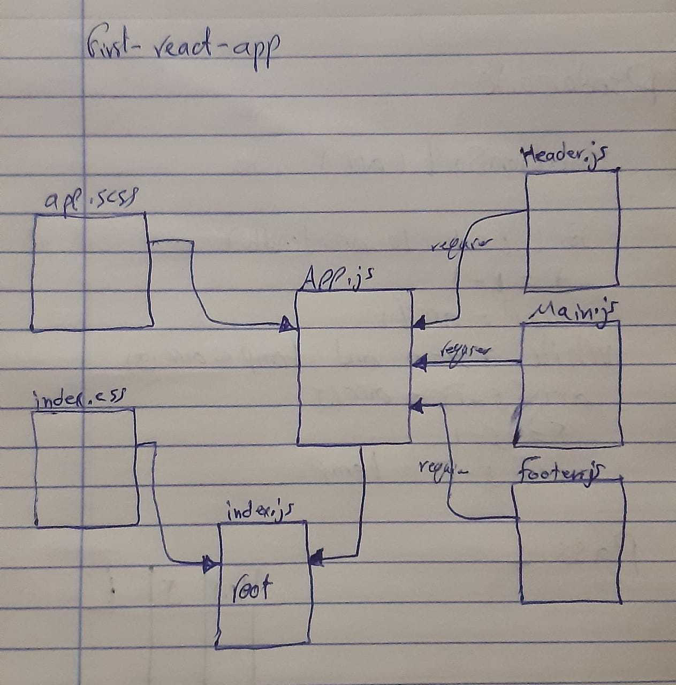

# first-react-app

# LAB - Class 26

### Author: Ahmad Sawalqeh

### Links and Resources

- [submission PR](https://github.com/Ahmad-Sawalqeh/authenticated-api-server/pull/1)

### Setup
How to initialize/run your application (where applicable)
* npm run start

# UML

